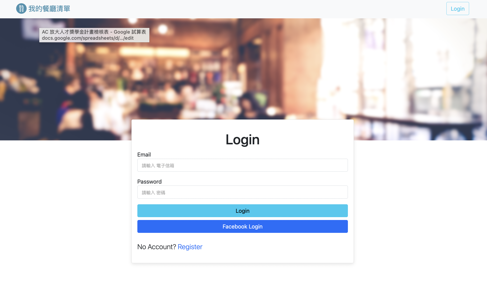
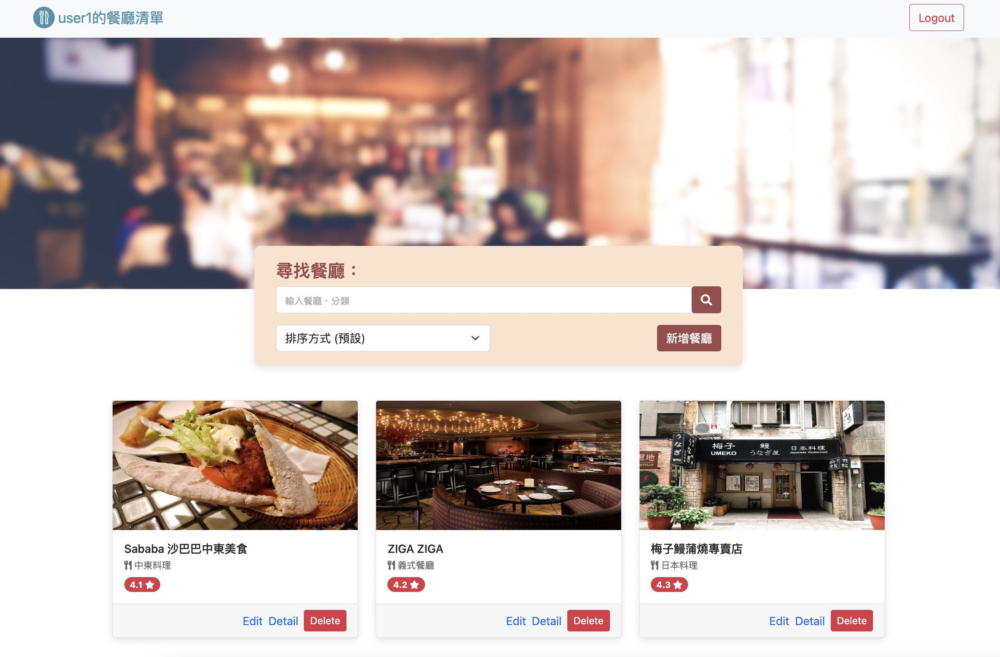

# 我的餐廳清單



## 專案介紹
本專案提供使用者管理自己的餐廳清單，可進行新增、刪除、編輯、查詢餐廳等功能。

## 產品功能
* 使用者可選擇以 Email 或 Facebook 進行註冊
* 登入後可於主頁瀏覽所有餐廳列表
* 點擊單一餐廳可閱讀詳細資訊
* 可新增餐廳列表
* 可編輯餐廳資訊
* 可刪除餐廳列表
* 可以關鍵字查詢符合店名或餐廳類型之店家列表
* 可供使用者於搜尋中自訂排序規則

## 開始使用
1. 確認本地已安裝Node.js與npm
2. 打開terminal，輸入以下指令Clone本專案至本地
  ```
  $ git clone https://github.com/Nilney/restaurant_list.git
  ```
3. 進入此專案資料夾
  ```
  $ cd restaurant_list
  ```
4. 輸入以下指令以安裝 npm 套件
  ```
  $ npm install
  ```
5. 參考 `.env.example` 設置你的環境變數文件 `.env`
  ```
  MONGODB_URI=SKIP
  FACEBOOK_ID=SKIP
  FACEBOOK_SECRET=SKIP
  FACEBOOK_CALLBACK=http://localhost:3000/auth/facebook/callback
  PORT=3000
  SESSION_SECRET=SKIP
  ```
6. 可自行依需求建立種子資料
  ```
  $ npm run seed
  ```
7. 輸入以下指令以啟動本專案
  ```
  $ npm run start
  ```
8. 顯示以下資訊代表本專案順利運行，輸入網址至瀏覽器便可瀏覽此專案網頁
  ```
  The web app is listening on http://localhost:3000
  ```
9. 若要停止使用，請輸入以下指令
  ```
  $ ctrl + c
  ```

## 開發工具
* Node.js @14.16.0
* Express @4.18.2
* Express-handlebars @3.0.0
* Bootstrap 5.1.3
* Font-awesome 5.8.1
* 其餘詳見package.json